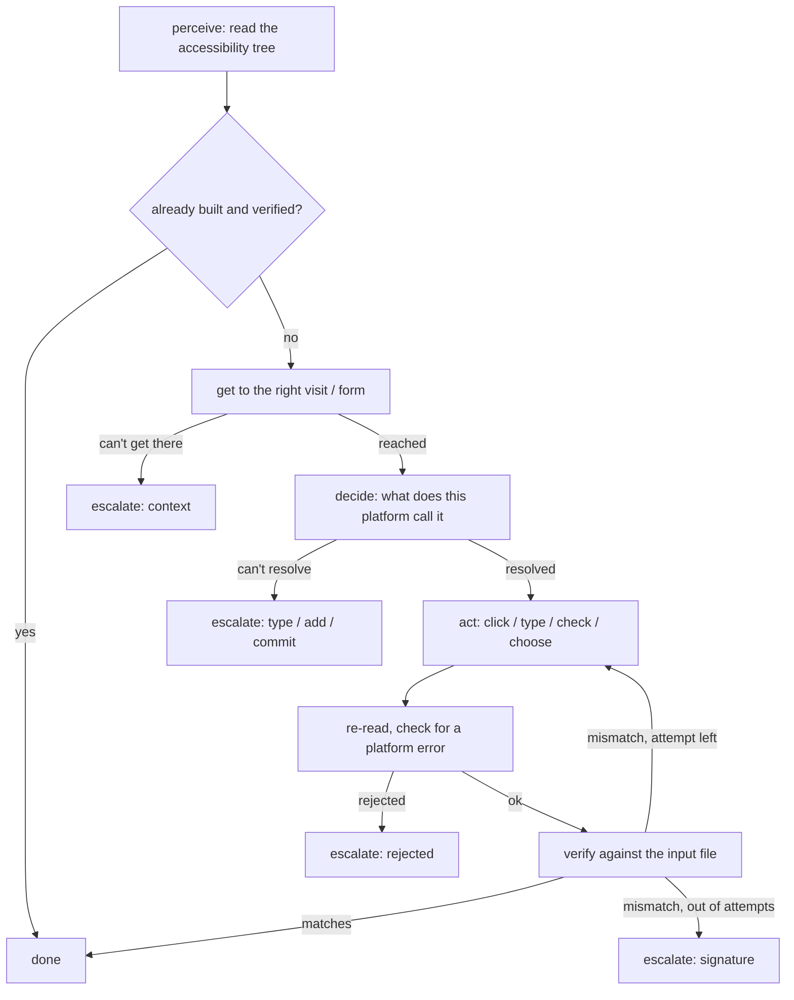
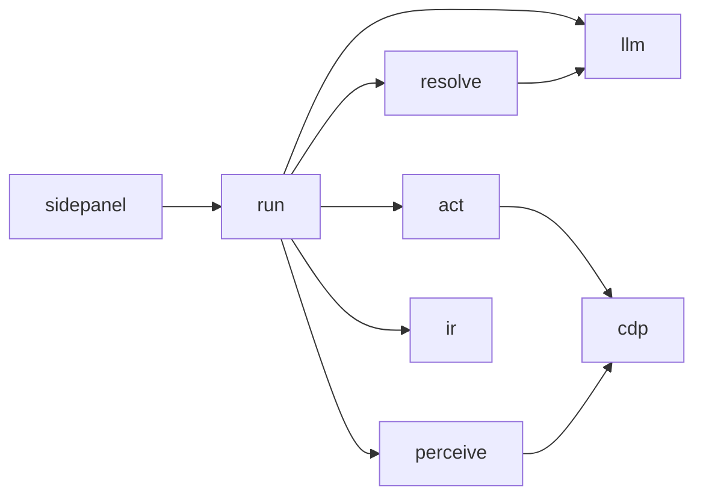

# Architecture — Intake Study Builder Agent

A Chrome extension that reads an eSource platform through its **accessibility
tree** and a study `.ir.json`, and builds that study by driving the UI. No code
in here is tied to any one platform — no CSS selector, element id, or button
label from the supplied mock appears anywhere in `src/`.

Running it is documented in the [repo root README](../README.md). This file is
the architecture.

---

## The loop

Every plan item — one visit, one form, one field — goes through the same loop
and always ends **built** or **escalated**, never silently skipped. That's
checked by `assertTerminated()`, not just claimed: the panel prints
`unaccounted 0` or reports a bug.

1. **Perceive** — read the page's accessibility tree over CDP
   (`Accessibility.getFullAXTree`), prune it to what a builder can act on
   (buttons, textboxes, checkboxes, comboboxes, list items…) plus the context
   that explains them (headings, labels, dialogs, errors).
2. **Decide** — work out what this platform calls things. Three layers,
   cheapest first: a synonym table for the 13 canonical field types, a
   per-session cache (turns 195 field questions into ~13), then the model,
   asked once per unresolved question. Abstains rather than guessing when two
   answers look equally likely.
3. **Act** — click, type, check, or choose, through the browser's real input
   pipeline (`Input.dispatchMouseEvent`, `Input.insertText`). Every write
   re-reads and re-locates the control first — the previous write already
   invalidated any saved reference.
4. **Verify** — re-read the control after every write and compare it against
   the IR entry: label, type, required flag, every coded value pair,
   range/units, skip logic. Presence alone never counts.
5. **Escalate** — after a retry still fails, the item goes on a gate card
   keyed by the *question*, not the item. 40 fields blocked on the same
   missing control produce one card, not 40.

---

## Modules

Dependency direction is one-way. Nothing lower reaches back up, which is why
`compactFrom`, `parseIR`, and every decision function are testable in plain
Node with no browser.

| File | Responsible for |
|---|---|
| `src/sw.ts` | Opens the side panel on icon click. Holds no state — a service worker gets killed on idle and would take a mid-run session with it. |
| `src/cdp.ts` | Attach/detach lifecycle, `send()` for CDP commands, marking the page stale when it navigates or re-renders. |
| `src/perceive.ts` | Raw AX tree → compact view, the diff/classify/settle primitives, the three "show me more" tools for the model. |
| `src/ir.ts` | Parses and validates the input file, computes the plan (visits → forms → fields, dependency-ordered on skip logic). |
| `src/act.ts` | `locate()`, the four write primitives, navigation (`home`, `ensureContext`), per-write read-back. |
| `src/resolve.ts` | Synonym table + acceptance rule, library discovery, designer vocabulary, the batched model call. |
| `src/run.ts` | The loop, the session, the two-phase ledger, `verify()`, the gate queue, derived status. |
| `src/llm.ts` | One `chat()` for the whole agent — provider config, timeouts, readable errors. Mistral is wired. |
| `src/sidepanel.ts/.html` | The panel: Build tab (load IR, Start, gate cards) and Trace tab (perception numbers, ledger, level-2 tools). |

---

## How the model is used

- Asked once per unresolved **type**, not once per field — 13 questions cover
  195 fields, because the answer is cached as a platform fact.
- A returned `ref` has to exist in the snapshot it was asked about, or it's
  thrown out. The model never gets to name a selector, only point at a node
  already on the page.
- Confidence below 0.7 escalates instead of guessing.
- One veto: if the label it picked is the exact name of a *different*
  canonical type (e.g. it answers "Select One" for a `radio` question, but
  "Select One" is what this platform calls `single_select`), the answer is
  rejected even at high confidence. This is the near-neighbour trap the brief
  warns about — "Select One" next to "Select One (Expanded)".
- Same trust boundary is used for "which control adds a visit" and "which
  control navigates here" when the synonym pass and the discovered vocabulary
  both come up empty, not only for type questions.

## How escalating works

- Gate cards are keyed by the unresolved question, so repeats collapse into
  one card with every blocked item listed.
- A card only offers clickable candidates when the loop actually reads that
  answer back — type, the add control, the commit control, or a navigation
  target. Everything else is a report: it says what didn't read back and that
  the fix is on the platform. A dead button would look answered and do
  nothing on Resume, so it's never shown.
- Nothing escalated is ever built. The run never blocks on a card — it queues
  what it can't resolve and keeps going.

## How re-running works

| Session | Behaviour |
|---|---|
| Same panel | Confirmed history trusted, only the interrupted item and unanswered cards are re-checked, learned facts reused |
| Panel reopened | Returns to the platform root, re-verifies every item against the input file before building anything, facts rediscovered |

Either way it's a diff against what's on screen, not a replay of the input
file — no duplicate visits, forms, or fields.

---

## Limitations — where it fails

Measured across a matrix of 4 platforms × 3 study files × 2 repetitions in a
real browser. Full numbers and per-fix writeup: [../REPORT.md](../REPORT.md).

**Structure is solid, field-level detail varies by platform.**

Every visit and every form asked for was created, on every platform, in every
run. Field recall is where the gaps show up:

| Platform | smoke (34 fields) | struct (84) | awkward (32) |
|---|---|---|---|
| Mock A *(supplied)* | 100% | 100% | 100% |
| Veridian EDC | 79% | 100% | 100% |
| SourceOne | 74% | 87–94% | 81% |
| TrialForge | 56% | 55% | 31–44% |

Every gap is on the gate queue with a reason attached, none of it silent. By
category:

| Category | What it is |
|---|---|
| `field.range` | a min/max control the designer vocabulary doesn't reach |
| `field.options` | coded values through a bulk-paste box whose separator isn't `code=label` |
| `type:<canonical>` | no library entry reads as this type, and the model won't commit either |
| `editor:*` / `unbuilt:field` | a control the editor doesn't offer under any word in the vocabulary |

Other known limits:

- **Recurring-form reuse isn't implemented.** The agent knows which form
  definitions repeat across visits (17 distinct definitions behind 28
  appearances in the supplied study) but builds every occurrence
  independently. Correct, just slower.
- **Only tested against 4 platforms**, and 3 of them were written for this
  test. Nothing in `src/` names any of them by string, and the fixes made
  during testing are all stated as general properties — but a 5th platform
  will find something new.
- **Model answers vary between runs.** Two of the twelve lanes differed
  between repetitions, both times a confidence score landing on either side
  of the 0.7 threshold. The deterministic layers (synonym scoring, structural
  checks) don't vary at all.
- **`normName` strips signs**, so `-14` and `14` normalize the same. A window
  or range check that needs to tell a negative value from its positive
  wouldn't catch a mismatch there. No fixture has hit this yet.
- **Drift in an already-built item isn't caught within a session.** If
  someone edits a field on the platform between a Stop and a Resume, nothing
  detects it — closing and reopening the panel forces the full re-verify that
  would catch it.
- **Cross-origin iframes are out of scope.** Same-origin frames work.
