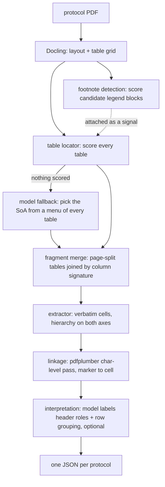

# Architecture — Schedule of Activities extraction

Finds the Schedule of Activities in any clinical trial protocol PDF and
produces a faithful, machine-readable representation of it, footnotes
included. Nothing here is tuned to the five sample PDFs — no page numbers,
sponsor names, or template strings appear in `soa/`.

Running it is documented in the [repo root README](../README.md). This file
is the architecture.

---

## Pipeline



| Stage | Module |
|---|---|
| parse, orchestration, per-document metadata | [`soa/pipeline.py`](soa/pipeline.py) |
| footnote detection (scoring) | [`soa/footnotes.py`](soa/footnotes.py) |
| SoA table identification + page-split merge | [`soa/locator.py`](soa/locator.py) |
| model fallback when no table scores; column-collapse flag | [`soa/fallback.py`](soa/fallback.py) |
| marker → cell linkage | [`soa/linkage.py`](soa/linkage.py) |
| schema construction | [`soa/extract.py`](soa/extract.py) |
| interpretation layer | [`soa/llm.py`](soa/llm.py) |
| upload / parallel run / review UI | [`soa/server.py`](soa/server.py), [`web/`](web/) |
| local run log | [`soa/runs.py`](soa/runs.py) |
| fixed deliverable output, rendered | [`streamlit_app.py`](streamlit_app.py) — reads the five committed `outputs/*-soa.json`, never re-extracts |

### Why footnotes are detected before the table is picked

Footnote detection is table-agnostic and cheap — it attaches each legend
block to whatever table sits above it, SoA or not. The locator then uses
"does a footnote block hang off me" as one of its scoring signals: schedules
carry legends, most other tables don't. Linkage runs last, scoped to the
tables the locator actually selected, so a marker never gets matched against
a legend that belongs to a different table on the same page.

### The locator

Every table Docling finds gets scored. Nothing keys off a page number, table
index, sponsor name, or caption — the heading "Schedule of Activities" is
never matched, because across the five samples it's variously a flow chart, a
table of events, or an untitled appendix table.

| Rule | Points | Check |
|---|---|---|
| 1 | +1.0 | **Mark share** — fraction of non-empty body cells that read as an activity mark (`X`, `1X`, `3X/week`, `(X)`…). Bare integers don't count. Fires at ≥ 0.60. |
| 2 | +0.5 | **Footnote block present** below the table, from the detector above. |
| 3 | +0.5 | **Grid shape** — at least 5 body rows across at least 4 value columns. |
| 4 | gate | **Timepoint axis** — a header row or the label column carries at least 3 ordered timepoint-like labels. Failing this disqualifies the table outright. |

Selected at ≥ 1.5, flagged for review at 1.0–1.5, rejected below. Every table
above threshold is returned, ranked — a protocol can hold a main schedule
plus a PK or extension sub-schedule, so this never just takes the top one.

Page-split fragments are merged into one schedule when they sit on
consecutive pages and share a column signature (width + label-column count),
deliberately not matched on header text — a continuation page can abbreviate
or drop its headers.

### Model fallback — when no table scores

The four rules are a hard gate (rule 4) plus a scored sum. On an unseen
template — a landscape header, an OCR-mangled row, a Docling mis-parse — a real
schedule can score zero, and the pipeline would return no schedules at all.
`soa/fallback.py` is the only recovery path, and it runs **only** when the
rules select nothing.

It shows the model a menu of every table Docling found: caption, header-row
text, first-column row labels, grid shape, and the reason the rules rejected
it — **never a body cell value**, same data boundary as the interpretation
layer. The model returns which `table_id`(s) are the schedule (a page-split
one appears as several entries — it picks them all), or `none`. The pick is
validated against the real table ids, promoted to a normal `select` record,
run through the same page-split merge, and handed back to the deterministic
`assemble` / `link` / `interpret` path unchanged. A promoted group that fails
the same timepoint-axis check the rules apply is re-asked once (round 2); a
confident pick that still fails is kept but marked `recovered_unverified` and
flagged, a low-confidence one is dropped.

`review.fallback.outcome` records what happened: `recovered`,
`recovered_unverified`, `model_found_none`, `exhausted`, `no_tables`,
`model_error: <type>`, or `unavailable` (no key — a strict no-op, output
identical to a rules-only run). A hallucinated pick can name a table that
doesn't exist (rejected) or one that fails the structural check (re-asked,
then flagged); it can never drop a row or a column — the extractor still works
verbatim off the grid. On the five sample protocols the rules select cleanly
and this never fires.

**Column-axis collapse.** A sibling check, `check_column_axis`, runs on every
selected schedule regardless of how it was found. Rule 3 already states what a
schedule's grid looks like — at least `MIN_GRID_VALUE_COLS` (4) timepoint
columns. A table *selected* as a schedule that comes back under that is
internally inconsistent: either the parser merged its columns, or it was never
a schedule. Either way it sets `review.column_axis_warning`.

The test is the locator's own constant, not a shape read off any one document,
so a parse that merges twenty visit columns into three trips it exactly as one
that merges them into one. The count of timepoint labels still in the header
rows is reported as corroborating evidence, never as a second gate. With a key,
one small call reads the column count the header text actually describes. The
parser's under-count is not repaired here, but it is no longer silent.

### The extractor

Cell values come through verbatim — no boolean coercion, no normalization.
`3X/week`, `(X)`, `Weekly x 2 weeks` are captured as written. Both axes keep
their full hierarchy: column headers keep their stacked path (`["VISIT 1",
"WEEK -2"]`), rows keep their category/activity distinction.

### Linkage, and why it needs a second reader

Docling drops most superscript markers — on one protocol's SoA, 65 `X` cells
come back as bare `X` with the `a`/`b` markers gone. `soa/linkage.py` reads
the same page again with pdfplumber at the character level:

1. **Superscript pass** — a glyph counts as a marker when it's both smaller
   than its line's body font (≤ 0.92×) *and* raised above the baseline
   (≥ 1pt). Size alone flags small-caps column headers; raise alone flags
   noise. Together they isolate real markers.
2. **Cell-text pass** — symbol markers are often set inline at full size
   (`* Morphine`), which the char pass can't see. A marker token in a cell's
   own text counts too, but only when the legend actually defines it.

### Interpretation — where the model is used, and where it isn't

The model answers exactly one question: which header row means study period
vs visit number vs day vs window, and which rows are category headings
rather than activities. It never sees a cell value or the protocol prose, and
its answer is validated index-by-index against structure already extracted —
anything it omits or gets wrong falls back to the rule-based default and is
recorded in `review.interpretation`. It can't drop a row or a visit.

---

## Output schema

One JSON file per protocol. Shape, trimmed:

```jsonc
{
  "document":  { "filename", "pages", "tables", "labels": [...] },
  "schedules": [{
    "soa_id": "soa-1", "pages": [53, 54],
    "fragments": [{ "header_rows", "columns", "rows", "cells" }],
    "footnotes": [{ "marker", "text", "scope", "targets", "verdict" }],
    "detection": [{ "table_id", "score", "signals", "gate" }],
    "review": { "markers_in_table_without_definition", "footnotes_never_used_in_table",
                "column_axis_warning"? }
  }],
  "review":       { "schedules_found", "near_miss_tables", "fallback"? },
  "table_scores": [ /* every table, score, rejection reason */ ]
}
```

`review.fallback` is present only when the rules found nothing and the model
fallback ran; `column_axis_warning` and a `detection[].verdict_source` of
`model_fallback` appear only when they apply. A clean rules-only run carries
none of them.

Why it looks like this:

- **Cells are a sparse list** (`{row, col, value}`), not a dense matrix. An
  SoA is mostly empty, and a dense matrix has to invent a filler value that
  becomes indistinguishable from a real dash.
- **Row/column identity is an integer index into the source grid**, so any
  claim in the output traces back to a specific place on a specific page.
- **`header_path` per column**, not a flattened string — keeps the stacked
  hierarchy the brief asks for.
- **Three buckets everywhere** — accept / review / discard — for footnote
  blocks, tables, and marker linkage. Nothing is silently dropped or
  silently accepted.

## Tools evaluated

| Tool | Verdict | Why |
|---|---|---|
| **Docling** | chosen, primary reader | Only option tried that returns a real table grid with per-cell spans and bounding boxes, which is what makes marker→cell mapping possible at all. |
| **pdfplumber** | chosen, narrow scope | Used only for per-character size and baseline — the only way to see a superscript marker. Not used for table extraction. |
| Docling's `FOOTNOTE` label | rejected | Trained on journal PDFs. 4 hits total across the corpus, mislabelled its own legend 4 out of 5 times on one protocol. Replaced by structural scoring. |
| Generic PDF→text | rejected | Reading order collapses on a landscape SoA, column identity is gone. |
| An LLM reading the raw page | rejected as the extractor | Recall is the graded axis, and a model that silently drops a row is the exact failure to avoid. Used in two narrow, index-validated roles instead: interpretation, and table *selection* when the structural rules score nothing (`soa/fallback.py`) — never structure extraction. |
| Mistral | chosen for interpretation + fallback | Same provider as Part 1, one key covers both. A key whose tier lacks the large model gets a 403 rather than silently downgrading, so `soa/llm.py` walks a fallback chain. The fallback picker retries once on a transient 429/5xx — it is the "don't escalate to a human" path. |

---

## Limitations — where it breaks

1. **protocol12: Docling parses the SoA as 42 × 2.** The visit columns
   collapse into one column. Rows, footnotes, and linkage survive; the column
   axis doesn't. This is now **detected and flagged** —
   `review.column_axis_warning` fires whenever a selected schedule comes back
   with fewer value columns than rule 3 requires of a schedule — so it is no
   longer silent, and the same test catches a *partial* merge on an unseen
   document, not only this one's collapse to a single column. The column count
   itself is still under-parsed; the fix is the pdfplumber re-grid in *What's
   next*, not done here. (The committed `protocol12-soa.json` predates the flag
   and gains it on the next corpus regen.)
2. **A continuation page Docling re-columns differently won't merge.** It
   gets reported as a separate schedule instead of joined — visible, but
   wrong.
3. **Scanned pages return nothing.** OCR is off (`do_ocr=False`). A scanned
   SoA has no text to score; the locator reports no schedule found and the
   model fallback has nothing to work from either (`outcome: no_tables`).
4. **Rule 4 is still a hard gate in the scorer.** A landscape or badly-OCR'd
   header row disqualifies a real SoA outright regardless of its mark share.
   The model fallback now recovers this case *when a key is present* — it
   found the right table on all five protocols with every heuristic select
   wiped — but with no key it remains a total miss.
5. **Uniform-case abbreviation lines earn footnote-detection points** (e.g.
   `SCID : The Structured Clinical Interview…`). These land in `review`,
   never `accept`, and link to nothing — flagged, not silently wrong.
6. **Verification done so far is detection-level, not extraction-level.**
   The locator's page/dimension picks were checked against the source PDF
   for all five protocols, footnote text was read and compared, and linkage
   was spot-checked at the character level on one protocol. Row and column
   counts have **not** been reconciled against the rendered page on any
   protocol — since a dropped row is the most heavily penalized failure,
   that's the biggest open gap.
7. **Model unavailable** (no key, quota, network) falls back to the
   rule-based labels and records it in `review.interpretation`. No structure
   is lost either way.

Per-protocol numbers from the committed corpus run:

| Doc | SoA pages | Fragments | Rows | Cols | Footnotes | Linkages | Note |
|---|---|---|---|---|---|---|---|
| protocol1 | 53–54 | 2 → merged | 56 | 16 | 4 | 5 | all linked |
| protocol5 | 50 | 1 | 30 | 11 | 10 | 9 | `*` has no target |
| protocol9 | 26–28 | 3 → merged | 39 | 33 | 4 | 3 | `SCID` false-positive marker |
| protocol12 | 48 | 1 | 40 | **1** | 12 | 12 | column axis lost — now flagged (`column_axis_warning`) |
| protocol15 | 25 | 1 | 34 | 9 | 5 | 47 | `Xa` has no target |

Runtime is 35s–4min per document (Docling conversion dominates); documents
run 4-way parallel.

---

## What's next

1. **A table-structure cross-check** — re-derive the column grid from
   pdfplumber's ruling lines and compare against Docling's column count. The
   collapse is now flagged on protocol12; this would actually *rebuild* the
   lost columns instead of just reporting the under-count.
2. **The cell-by-cell verification pass on all five protocols**, rasterized
   page against extracted grid. Detection-level confidence isn't
   extraction-level confidence.
3. **Row/column recall assertions** — count row labels pdfplumber sees
   inside the table bbox and compare against the grid, same for columns.
4. **An OCR path with a benchmark**, so a scanned protocol degrades instead
   of returning nothing.
5. **Rule 4 demoted from gate to weighted signal**, once there's a corpus
   large enough to show what that costs in false positives. The model
   fallback covers a gated-out SoA today, but only when a key is present and
   at the cost of a round-trip — a scored signal would catch it in the rules.

## AI tools used

Claude Code wrote most of this repository, working from the standard in
[`CLAUDE.md`](CLAUDE.md). Fast at mechanical lifting and at reading measured
data — the rule 1 and rule 3 thresholds both came from dumping every table's
statistics across the corpus and reading the separation, not from reasoning
about what an SoA "should" look like. Its first instinct on almost every rule
was to pattern-match strings from one sample PDF (sponsor names, legend
headers, the literal phrase "Schedule of Activities"), which is exactly the
overfit this assignment disqualifies — kept out only by an explicit written
standard and repeated correction.
